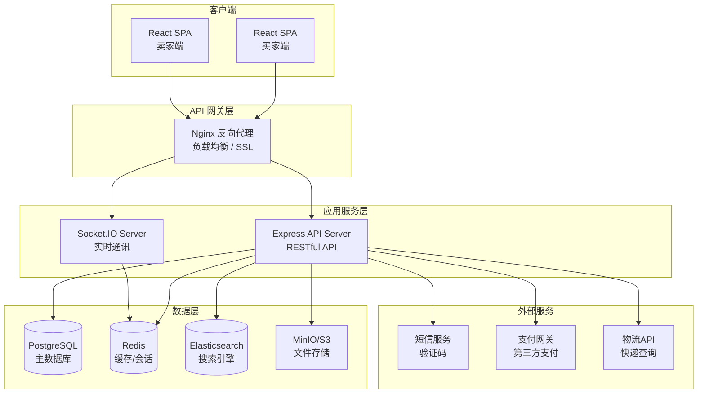
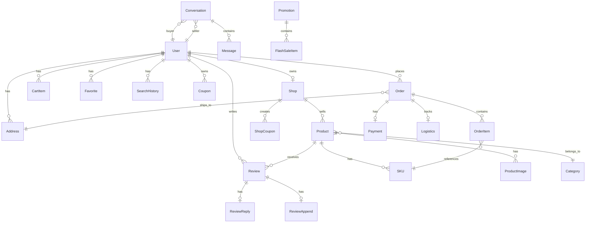

# 技术设计文档 - 换换(HuanHuan) 以物换物交易平台

## 概述

换换(huanhuan.com)是一个B2B以物换物交易平台，采用前后端分离架构。前端使用 React + TypeScript 构建 SPA 应用，后端使用 Node.js + Express 提供 RESTful API，数据库采用 SQLite (开发) / PostgreSQL (生产) + Redis 组合。平台核心是以"换贝"为计价单位的以物换物系统，企业商家可上架商品并换取所需商品，平台双方各收5%手续费。

### 技术栈选择

| 层级 | 技术选型 | 说明 |
|------|---------|------|
| 前端框架 | React 18 + TypeScript | 组件化开发，类型安全 |
| 状态管理 | Zustand | 轻量级状态管理，适合中大型应用 |
| UI 组件库 | Ant Design 5 | 企业级 UI 组件，自定义主题支持 |
| 前端路由 | React Router v6 | SPA 路由管理 |
| HTTP 客户端 | Axios | 请求拦截、响应处理 |
| 后端框架 | Node.js + Express | 高性能异步 I/O |
| ORM | Prisma | 类型安全的数据库访问 |
| 主数据库 | PostgreSQL 15 | 关系型数据存储 |
| 缓存 | Redis | 会话管理、搜索缓存、消息队列 |
| 搜索引擎 | Elasticsearch | 全文搜索、商品搜索 |
| 实时通讯 | Socket.IO | WebSocket 双向通信 |
| 文件存储 | MinIO / S3 | 图片和文件存储 |
| 认证 | JWT + bcrypt | Token 认证和密码加密 |
| API 文档 | Swagger / OpenAPI | 接口文档自动生成 |
| 测试 | Vitest + fast-check | 单元测试 + 属性测试 |
| 构建工具 | Vite | 快速开发和构建 |

## 架构

### 系统架构图



### 分层架构

```
├── 表现层 (Presentation Layer)
│   ├── React 组件 (Pages / Components)
│   ├── 路由管理 (React Router)
│   └── 状态管理 (Zustand Stores)
├── API 层 (API Layer)
│   ├── 路由定义 (Express Routes)
│   ├── 中间件 (Auth / Validation / Error Handling)
│   └── 控制器 (Controllers)
├── 业务逻辑层 (Service Layer)
│   ├── 用户服务 (UserService)
│   ├── 商品服务 (ProductService)
│   ├── 订单服务 (OrderService)
│   ├── 支付服务 (PaymentService)
│   ├── 搜索服务 (SearchService)
│   ├── 聊天服务 (ChatService)
│   ├── 物流服务 (LogisticsService)
│   ├── 促销服务 (PromotionService)
│   └── 评价服务 (ReviewService)
├── 数据访问层 (Data Access Layer)
│   ├── Prisma ORM (PostgreSQL)
│   ├── Redis Client
│   └── Elasticsearch Client
└── 基础设施层 (Infrastructure Layer)
    ├── 文件存储 (MinIO/S3)
    ├── 短信/邮件服务
    └── 第三方支付网关
```

## 组件与接口

### 前端核心组件

#### 1. 首页模块 (Homepage)

```
HomePage
├── NavBar                    # 顶部导航栏（Logo、搜索框、用户入口、购物车）
├── CategoryNav               # 品类导航栏
├── BannerCarousel            # 轮播广告组件（自动/手动切换）
├── FlashSaleSection          # 限时秒杀区域（倒计时 + 商品列表）
├── CategoryQuickLinks        # 热门品类快捷入口
├── RecommendationFeed        # 个性化推荐瀑布流
└── Footer                    # 页脚信息栏
```

#### 2. 搜索模块 (Search)

```
SearchPage
├── SearchBar                 # 搜索输入框（自动补全、搜索建议）
├── SearchHistory             # 搜索历史（展示/清除）
├── FilterPanel               # 筛选面板（价格、销量、评分、发货地）
├── SortBar                   # 排序栏（综合、销量、价格升/降序）
├── ViewToggle                # 视图切换（网格/列表）
├── ProductGrid / ProductList # 商品结果展示
└── Pagination                # 分页组件
```

#### 3. 商品详情模块 (ProductDetail)

```
ProductDetailPage
├── ImageCarousel             # 图片/视频轮播（支持缩放）
├── ProductInfo               # 商品标题、价格、折扣标签
├── SkuSelector               # SKU 规格选择器
├── ProductDescription        # 富文本商品描述
├── ShopCard                  # 店铺信息卡片
├── ReviewSection             # 评价区域
├── RecommendList             # 猜你喜欢推荐
└── BottomActionBar           # 底部操作栏（加购/立即购买）
```

#### 4. 购物车模块 (Cart)

```
CartPage
├── CartHeader                # 全选/管理按钮
├── ShopGroup                 # 按店铺分组
│   ├── ShopCheckbox          # 店铺全选
│   └── CartItem              # 商品项（图片、规格、数量调节、价格）
├── CouponInput               # 优惠券输入
└── CartFooter                # 底部结算栏（总价、结算按钮）
```

#### 5. 结算模块 (Checkout)

```
CheckoutPage
├── AddressSelector           # 收货地址选择/管理
├── OrderItemList             # 订单商品清单
├── PaymentMethodSelector     # 支付方式选择
├── CouponSelector            # 优惠券/红包选择
├── OrderSummary              # 费用明细（商品金额、运费、优惠、总计）
└── SubmitButton              # 提交订单按钮
```

#### 6. 用户中心 (UserCenter)

```
UserCenterPage
├── UserSidebar               # 侧边导航菜单
├── ProfilePage               # 个人信息编辑
├── OrderListPage             # 订单管理（五状态 Tab）
├── AddressPage               # 收货地址管理
├── FavoritesPage             # 收藏夹
├── BrowsingHistoryPage       # 浏览历史
├── CouponPage                # 优惠券管理
├── MessageCenter             # 消息通知中心
└── SecurityPage              # 账户安全设置
```

#### 7. 卖家中心 (SellerCenter)

```
SellerCenterPage
├── SellerSidebar             # 侧边导航
├── ShopSettingsPage          # 店铺管理
├── ProductManagePage         # 商品管理（发布/编辑/上下架）
├── OrderManagePage           # 订单管理（发货/退款）
├── AnalyticsDashboard        # 数据分析面板
├── MarketingToolsPage        # 营销工具（优惠券/满减）
└── CustomerServicePage       # 客服消息管理
```

### 后端 API 接口设计

#### 认证接口

| 方法 | 路径 | 说明 |
|------|------|------|
| POST | `/api/auth/register` | 用户注册（手机号/邮箱） |
| POST | `/api/auth/login` | 用户登录 |
| POST | `/api/auth/send-code` | 发送验证码 |
| POST | `/api/auth/reset-password` | 重置密码 |
| POST | `/api/auth/refresh-token` | 刷新 Token |

#### 商品接口

| 方法 | 路径 | 说明 |
|------|------|------|
| GET | `/api/products` | 商品列表（支持搜索/筛选/排序） |
| GET | `/api/products/:id` | 商品详情 |
| POST | `/api/products` | 发布商品（Seller） |
| PUT | `/api/products/:id` | 编辑商品（Seller） |
| PATCH | `/api/products/:id/status` | 上架/下架（Seller） |
| GET | `/api/products/:id/reviews` | 商品评价列表 |
| GET | `/api/products/recommendations` | 个性化推荐 |

#### 购物车接口

| 方法 | 路径 | 说明 |
|------|------|------|
| GET | `/api/cart` | 获取购物车 |
| POST | `/api/cart/items` | 添加商品到购物车 |
| PUT | `/api/cart/items/:id` | 修改商品数量 |
| DELETE | `/api/cart/items/:id` | 删除购物车商品 |
| POST | `/api/cart/coupon` | 应用优惠券 |

#### 订单接口

| 方法 | 路径 | 说明 |
|------|------|------|
| POST | `/api/orders` | 创建订单 |
| GET | `/api/orders` | 订单列表（按状态筛选） |
| GET | `/api/orders/:id` | 订单详情 |
| PATCH | `/api/orders/:id/ship` | 发货（Seller） |
| PATCH | `/api/orders/:id/confirm` | 确认收货（Buyer） |
| POST | `/api/orders/:id/refund` | 申请退款 |

#### 支付接口

| 方法 | 路径 | 说明 |
|------|------|------|
| POST | `/api/payments` | 发起支付 |
| GET | `/api/payments/:id/status` | 查询支付状态 |
| POST | `/api/payments/callback` | 支付回调 |
| POST | `/api/payments/:id/refund` | 退款处理 |

#### 聊天接口

| 方法 | 路径 | 说明 |
|------|------|------|
| GET | `/api/chat/conversations` | 会话列表 |
| GET | `/api/chat/conversations/:id/messages` | 聊天记录 |
| POST | `/api/chat/conversations/:id/messages` | 发送消息（REST 备用） |

WebSocket 事件：
- `chat:message` - 发送/接收消息
- `chat:typing` - 输入状态
- `chat:read` - 已读回执
- `notification:new` - 新通知推送

#### 其他接口

| 方法 | 路径 | 说明 |
|------|------|------|
| GET | `/api/search/suggestions` | 搜索建议 |
| POST | `/api/search/image` | 图片搜索 |
| GET | `/api/search/history` | 搜索历史 |
| DELETE | `/api/search/history` | 清除搜索历史 |
| GET | `/api/logistics/:orderId` | 物流追踪 |
| POST | `/api/reviews` | 提交评价 |
| POST | `/api/reviews/:id/append` | 追评 |
| POST | `/api/reviews/:id/reply` | 卖家回复评价 |
| GET | `/api/promotions/flash-sales` | 秒杀活动列表 |
| POST | `/api/promotions/check-in` | 每日签到 |
| GET | `/api/user/coupons` | 用户优惠券列表 |
| GET | `/api/seller/analytics` | 卖家数据分析 |


## 数据模型

### ER 关系图



### 核心数据模型定义

#### User（用户）

```typescript
interface User {
  id: string;                  // UUID 主键
  phone?: string;              // 手机号（唯一）
  email?: string;              // 邮箱（唯一）
  passwordHash?: string;       // bcrypt 加密密码
  nickname: string;            // 昵称
  avatar?: string;             // 头像 URL
  gender?: 'male' | 'female' | 'other';
  birthday?: Date;
  role: 'buyer' | 'seller' | 'admin';
  status: 'active' | 'locked' | 'disabled';
  loginFailCount: number;      // 连续登录失败次数
  lockedUntil?: Date;          // 账户锁定截止时间
  createdAt: Date;
  updatedAt: Date;
}
```

#### Address（收货地址）

```typescript
interface Address {
  id: string;
  userId: string;
  name: string;                // 收件人姓名
  phone: string;               // 收件人电话
  province: string;
  city: string;
  district: string;
  detail: string;              // 详细地址
  isDefault: boolean;
  createdAt: Date;
  updatedAt: Date;
}
```

#### Shop（店铺）

```typescript
interface Shop {
  id: string;
  sellerId: string;            // 关联 User
  name: string;
  logo?: string;
  description?: string;
  rating: number;              // 店铺评分
  followerCount: number;
  layoutConfig?: object;       // 店铺装修配置 JSON
  status: 'active' | 'suspended';
  createdAt: Date;
  updatedAt: Date;
}
```

#### Category（商品分类）

```typescript
interface Category {
  id: string;
  name: string;
  icon?: string;
  parentId?: string;           // 父分类 ID（支持多级分类）
  sortOrder: number;
  createdAt: Date;
}
```

#### Product（商品）

```typescript
interface Product {
  id: string;
  shopId: string;
  categoryId: string;
  title: string;
  description: string;         // 富文本描述
  minPrice: number;            // 最低 SKU 价格（冗余字段，加速查询）
  maxPrice: number;
  salesCount: number;          // 销量
  rating: number;              // 平均评分
  reviewCount: number;
  status: 'draft' | 'active' | 'inactive';
  videoUrl?: string;           // 商品视频
  createdAt: Date;
  updatedAt: Date;
}
```

#### SKU（库存单位）

```typescript
interface SKU {
  id: string;
  productId: string;
  specs: Record<string, string>;  // 规格属性，如 { "颜色": "红色", "尺码": "XL" }
  price: number;
  originalPrice: number;
  stock: number;
  image?: string;
  status: 'active' | 'inactive';
  createdAt: Date;
  updatedAt: Date;
}
```

#### ProductImage（商品图片）

```typescript
interface ProductImage {
  id: string;
  productId: string;
  url: string;
  sortOrder: number;
  type: 'main' | 'detail';
}
```

#### CartItem（购物车项）

```typescript
interface CartItem {
  id: string;
  userId: string;
  skuId: string;
  quantity: number;
  selected: boolean;           // 是否选中
  createdAt: Date;
  updatedAt: Date;
}
```

#### Order（订单）

```typescript
interface Order {
  id: string;
  orderNo: string;             // 订单编号（展示用）
  buyerId: string;
  shopId: string;
  addressSnapshot: object;     // 下单时地址快照
  status: 'pending_payment' | 'pending_shipment' | 'shipped' | 'completed' | 'refunding' | 'refunded' | 'cancelled';
  totalAmount: number;         // 商品总金额
  shippingFee: number;         // 运费
  discountAmount: number;      // 优惠金额
  payableAmount: number;       // 应付金额
  couponId?: string;           // 使用的优惠券
  remark?: string;             // 买家备注
  paidAt?: Date;
  shippedAt?: Date;
  completedAt?: Date;
  autoConfirmAt?: Date;        // 自动确认收货时间（发货后 +15 天）
  createdAt: Date;
  updatedAt: Date;
}
```

#### OrderItem（订单商品项）

```typescript
interface OrderItem {
  id: string;
  orderId: string;
  skuId: string;
  productSnapshot: object;     // 下单时商品快照（标题、图片、规格）
  price: number;               // 下单时单价
  quantity: number;
  reviewId?: string;           // 关联评价
}
```

#### Payment（支付记录）

```typescript
interface Payment {
  id: string;
  orderId: string;
  method: 'balance' | 'bank_card' | 'third_party';
  amount: number;
  status: 'pending' | 'paid' | 'refunding' | 'refunded' | 'failed';
  transactionId?: string;      // 第三方交易号
  paidAt?: Date;
  refundedAt?: Date;
  createdAt: Date;
}
```

#### Logistics（物流信息）

```typescript
interface Logistics {
  id: string;
  orderId: string;
  carrier: string;             // 快递公司
  trackingNo: string;          // 物流单号
  status: 'shipped' | 'in_transit' | 'delivered';
  nodes: LogisticsNode[];      // 物流节点列表
  createdAt: Date;
  updatedAt: Date;
}

interface LogisticsNode {
  time: Date;
  location: string;
  description: string;
}
```

#### Review（评价）

```typescript
interface Review {
  id: string;
  userId: string;
  productId: string;
  orderItemId: string;
  rating: number;              // 1-5 星
  content: string;             // 文字评价（最多 500 字）
  images: string[];            // 评价图片 URL（最多 9 张）
  tags: string[];              // 自动生成的标签
  createdAt: Date;
}

interface ReviewAppend {
  id: string;
  reviewId: string;
  content: string;
  images: string[];
  createdAt: Date;
}

interface ReviewReply {
  id: string;
  reviewId: string;
  sellerId: string;
  content: string;
  createdAt: Date;
}
```

#### Conversation & Message（会话与消息）

```typescript
interface Conversation {
  id: string;
  buyerId: string;
  sellerId: string;
  shopId: string;
  lastMessageAt: Date;
  unreadCountBuyer: number;
  unreadCountSeller: number;
  createdAt: Date;
}

interface Message {
  id: string;
  conversationId: string;
  senderId: string;
  type: 'text' | 'image' | 'file';
  content: string;             // 文字内容或文件 URL
  fileName?: string;
  fileSize?: number;
  isRead: boolean;
  createdAt: Date;
}
```

#### Coupon（优惠券）

```typescript
interface Coupon {
  id: string;
  shopId?: string;             // 店铺优惠券关联店铺，平台券为 null
  name: string;
  type: 'fixed' | 'percentage';
  value: number;               // 面额或折扣比例
  minSpend: number;            // 使用门槛
  scope: 'all' | 'category' | 'product';
  scopeIds?: string[];         // 适用的分类或商品 ID
  startAt: Date;
  expireAt: Date;
  totalCount: number;          // 发放总量
  claimedCount: number;        // 已领取数量
  createdAt: Date;
}

interface UserCoupon {
  id: string;
  userId: string;
  couponId: string;
  status: 'unused' | 'used' | 'expired';
  usedAt?: Date;
  orderId?: string;
  createdAt: Date;
}
```

#### Promotion（促销活动）

```typescript
interface Promotion {
  id: string;
  type: 'flash_sale' | 'full_reduction';
  name: string;
  rules: object;               // 满减规则 JSON，如 { threshold: 200, discount: 30 }
  startAt: Date;
  endAt: Date;
  status: 'upcoming' | 'active' | 'ended';
  createdAt: Date;
}

interface FlashSaleItem {
  id: string;
  promotionId: string;
  productId: string;
  skuId: string;
  flashPrice: number;
  stock: number;               // 秒杀库存
  soldCount: number;
}
```

#### SearchHistory（搜索历史）

```typescript
interface SearchHistory {
  id: string;
  userId: string;
  keyword: string;
  createdAt: Date;
}
```

#### Favorite（收藏）

```typescript
interface Favorite {
  id: string;
  userId: string;
  type: 'product' | 'shop';
  targetId: string;            // 商品或店铺 ID
  createdAt: Date;
}
```

#### CheckIn（签到记录）

```typescript
interface CheckIn {
  id: string;
  userId: string;
  date: string;                // YYYY-MM-DD
  consecutiveDays: number;     // 连续签到天数
  reward: object;              // 奖励内容
  createdAt: Date;
}
```


## 正确性属性（Correctness Properties）

*正确性属性是指在系统所有有效执行中都应保持为真的特征或行为——本质上是关于系统应该做什么的形式化陈述。属性是人类可读规范与机器可验证正确性保证之间的桥梁。*

### Property 1: 搜索结果筛选与排序正确性

*For any* 商品数据集和筛选/排序条件组合，搜索返回的结果应满足：(a) 所有结果都匹配搜索关键词，(b) 所有结果都满足筛选条件（价格区间、销量、评分等），(c) 结果按指定排序规则正确排列。

**Validates: Requirements 2.2, 2.5, 2.6**

### Property 2: 搜索历史记录管理

*For any* 用户的搜索操作序列，搜索历史应满足：(a) 每次搜索后关键词被记录，(b) 历史按时间倒序排列且最多保留 20 条，(c) 清除单条后该条消失且其余不变，(d) 清除全部后历史为空。

**Validates: Requirements 2.7, 2.8, 2.9**

### Property 3: 商品详情页信息完整性

*For any* 商品，详情页渲染应包含：商品标题、价格信息（原价和促销价）、折扣标签、店铺名称、店铺评分和关注人数。若商品包含视频，视频应在轮播中排在首位。

**Validates: Requirements 3.2, 3.3, 3.6**

### Property 4: SKU 选择联动更新

*For any* 包含多个 SKU 的商品，当用户选择一个 SKU 规格组合时，页面展示的价格应等于该 SKU 的价格，库存信息应等于该 SKU 的库存数量。

**Validates: Requirements 3.4**

### Property 5: 购物车增删改的正确性

*For any* 购物车状态，添加一个商品应使购物车项数增加 1 且导航栏角标更新；将商品数量设为 0 或删除应使该商品从购物车中移除；修改数量应被限制在 1 到该 SKU 可用库存之间。

**Validates: Requirements 4.1, 4.3, 4.4**

### Property 6: 购物车分组与选择逻辑

*For any* 包含多个店铺商品的购物车，商品应按店铺分组展示。全选操作应选中所有商品，按店铺选择应选中该店铺所有商品，取消全选应取消所有选中。

**Validates: Requirements 4.2, 4.5**

### Property 7: 购物车价格计算正确性

*For any* 购物车中已选商品集合，总价格应等于所有已选商品的 (单价 × 数量) 之和，总数量应等于所有已选商品数量之和。若应用有效优惠券，总价应正确扣除优惠金额。

**Validates: Requirements 4.6, 4.7**

### Property 8: 结算到支付的数据传递完整性

*For any* 购物车中已选商品，点击结算后 Checkout_Module 接收到的商品列表应与购物车中已选商品完全一致（商品、SKU、数量均匹配）。

**Validates: Requirements 4.8**

### Property 9: 收货地址 CRUD 正确性

*For any* 用户的收货地址操作，新增地址应使地址数量加 1，编辑地址应更新对应字段，删除地址应使该地址消失。默认地址在结算页应被预选中。

**Validates: Requirements 5.1, 5.2, 6.3**

### Property 10: 订单金额计算不变量

*For any* 订单，应付金额 = 商品总金额 + 运费 - 优惠金额。此等式在订单的整个生命周期中始终成立。

**Validates: Requirements 5.5, 5.7**

### Property 11: 库存不足阻止下单

*For any* 订单提交请求，若其中任一商品的请求数量超过该 SKU 的可用库存，订单提交应被拒绝，并返回具体库存不足的商品信息。

**Validates: Requirements 5.9**

### Property 12: 用户信息与店铺信息更新持久化

*For any* 用户个人信息或店铺信息的编辑操作，更新后重新查询应返回更新后的值（round-trip 属性）。

**Validates: Requirements 6.1, 7.1**

### Property 13: 状态筛选正确性

*For any* 订单集合按状态筛选（待付款/待发货/待收货/已完成/退款售后），返回的订单应全部属于该状态。同理适用于优惠券按状态筛选（未使用/已使用/已过期）。

**Validates: Requirements 6.2, 6.6**

### Property 14: 收藏夹增删正确性

*For any* 商品或店铺，收藏操作后该项应出现在收藏夹中，取消收藏后该项应从收藏夹中消失。

**Validates: Requirements 6.4**

### Property 15: 浏览历史按日期分组

*For any* 浏览记录集合，按日期分组后，同一组内的所有记录应属于同一天，且组间按日期降序排列。

**Validates: Requirements 6.5**

### Property 16: 商品发布与编辑持久化

*For any* 有效的商品数据，发布后查询应返回完整的商品信息（round-trip 属性）。编辑后查询应返回更新后的值。上架/下架操作应正确切换商品状态。

**Validates: Requirements 7.2, 7.3**

### Property 17: 卖家发货状态流转

*For any* 待发货订单，卖家填写物流单号并发货后，订单状态应变为"已发货"，且物流信息应包含正确的快递公司和单号。

**Validates: Requirements 7.4, 11.1**

### Property 18: 评价提交权限控制

*For any* 订单，仅当订单状态为"已完成"时，买家才能提交评价。未完成的订单提交评价应被拒绝。

**Validates: Requirements 8.1**

### Property 19: 评价内容验证

*For any* 评价提交，评分必须在 1-5 之间，文字内容不超过 500 字，图片数量不超过 9 张。不满足条件的提交应被拒绝。

**Validates: Requirements 8.2**

### Property 20: 追评与回复的一次性约束

*For any* 评价，追评仅允许在初次评价后 15 天内进行一次，第二次追评应被拒绝。卖家回复仅允许一次，第二次回复应被拒绝。

**Validates: Requirements 8.3, 8.4**

### Property 21: 评价排序与筛选

*For any* 商品的评价集合，默认按时间倒序排列。按"好评/中评/差评/有图"筛选后，返回的评价应全部满足筛选条件。

**Validates: Requirements 8.5**

### Property 22: 平均评分计算正确性

*For any* 商品的评价集合，平均评分应等于所有评分之和除以评价数量，各星级占比应等于该星级评价数除以总评价数。

**Validates: Requirements 8.6**

### Property 23: 聊天消息收发正确性

*For any* 聊天会话，发送的文字消息应出现在会话的消息列表中。消息列表应按时间升序排列。

**Validates: Requirements 9.1, 9.2, 9.6**

### Property 24: 文件大小限制

*For any* 通过聊天发送的文件，若文件大小 ≤ 10MB 应被接受，若 > 10MB 应被拒绝。

**Validates: Requirements 9.3**

### Property 25: 未读消息计数

*For any* 新消息到达，接收方的未读消息计数应递增。标记已读后计数应相应递减。

**Validates: Requirements 9.4**

### Property 26: 离线消息存储与投递

*For any* 在接收方离线时发送的消息，消息应被持久化存储。当接收方上线后，应能获取到所有离线期间的消息。

**Validates: Requirements 9.5**

### Property 27: 担保交易状态机正确性

*For any* 支付交易，状态流转应遵循：待支付 → 已支付(托管中) → 已确认收货(释放给卖家)。买家确认收货应触发平台向卖家打款。退款审核通过后，退款金额应等于原支付金额。

**Validates: Requirements 10.2, 10.5, 11.5**

### Property 28: 物流节点时间线排序

*For any* 物流记录，物流节点应按时间升序排列，每个节点应包含时间、地点和状态描述三个字段。

**Validates: Requirements 11.3**

### Property 29: 自动确认收货

*For any* 已发货订单，若发货后超过 15 天买家未手动确认收货，系统应自动确认收货并触发打款流程。

**Validates: Requirements 11.6**

### Property 30: 满减优惠计算正确性

*For any* 满减活动（如满 200 减 30），当订单金额 ≥ 门槛时应扣减对应金额，当订单金额 < 门槛时不应扣减。

**Validates: Requirements 12.2**

### Property 31: 促销优先级与叠加规则

*For any* 同时适用多个促销的订单，最终价格应按"优惠券 → 满减 → 秒杀价"的优先级计算，且同类优惠不可叠加。

**Validates: Requirements 12.6**

### Property 32: 新用户自动发放优惠券

*For any* 新注册用户，注册完成后应自动获得新人专享优惠券。

**Validates: Requirements 12.4**

### Property 33: 每日签到连续天数计算

*For any* 用户签到序列，连续签到天数应正确递增。同一天重复签到不应重复计数。中断一天后连续天数应重置为 1。

**Validates: Requirements 12.5**

### Property 34: 密码加密 round-trip

*For any* 用户密码，使用 bcrypt 加密后存储的哈希值应能通过 bcrypt.compare 与原始密码匹配验证。

**Validates: Requirements 13.3**

### Property 35: 注册登录 round-trip

*For any* 有效的注册信息（手机号+验证码或邮箱+密码），注册成功后使用相同凭据登录应成功并返回有效的 JWT。

**Validates: Requirements 13.1, 13.2**

### Property 36: 账户锁定机制

*For any* 用户账户，连续 5 次输入错误密码后账户应被锁定。锁定期间即使输入正确密码也应拒绝登录。锁定 30 分钟后应自动解锁。

**Validates: Requirements 13.4**

### Property 37: JWT 有效期验证

*For any* 签发的 JWT Token，在 7 天有效期内验证应通过，超过 7 天后验证应失败。

**Validates: Requirements 13.5**

### Property 38: 密码重置 round-trip

*For any* 密码重置流程，验证码验证通过后设置新密码，使用新密码登录应成功，使用旧密码登录应失败。

**Validates: Requirements 13.6**

## 错误处理

### 前端错误处理

| 场景 | 处理方式 |
|------|---------|
| API 请求超时 | 展示"网络超时"提示，提供重试按钮 |
| 401 未授权 | 清除本地 Token，跳转登录页 |
| 403 无权限 | 展示"无权限访问"提示 |
| 404 资源不存在 | 展示"页面不存在"或"商品已下架"提示 |
| 422 参数校验失败 | 在表单对应字段下方展示错误信息 |
| 500 服务器错误 | 展示"服务器繁忙"提示，提供重试按钮 |
| WebSocket 断连 | 自动重连（指数退避），展示连接状态提示 |
| 图片加载失败 | 展示占位图 |

### 后端错误处理

| 场景 | 处理方式 |
|------|---------|
| 数据库连接失败 | 重试 3 次后返回 503，记录错误日志 |
| Redis 连接失败 | 降级为数据库直接查询 |
| Elasticsearch 不可用 | 降级为数据库 LIKE 查询 |
| 支付回调验签失败 | 拒绝处理，记录安全日志 |
| 库存扣减并发冲突 | 使用乐观锁重试，最多 3 次 |
| 文件上传失败 | 返回错误信息，前端提示重新上传 |
| 第三方服务超时 | 熔断器模式，降级处理 |

### 统一错误响应格式

```typescript
interface ErrorResponse {
  code: string;        // 业务错误码，如 "CART_STOCK_INSUFFICIENT"
  message: string;     // 用户可读的错误信息
  details?: object;    // 详细错误信息（如库存不足的具体商品）
  timestamp: string;   // ISO 8601 时间戳
}
```

## 测试策略

### 双重测试方法

本项目采用单元测试与属性测试相结合的双重测试策略：

- **单元测试（Vitest）**：验证具体示例、边界情况和错误条件
- **属性测试（fast-check）**：验证跨所有输入的通用属性

两者互补，缺一不可：单元测试捕获具体 bug，属性测试验证通用正确性。

### 属性测试配置

- **测试库**：fast-check（JavaScript/TypeScript 属性测试库）
- **最小迭代次数**：每个属性测试至少运行 100 次
- **标签格式**：每个属性测试必须包含注释引用设计文档中的属性编号
  - 格式：`Feature: cyberbuy-ecommerce-platform, Property {number}: {property_text}`
- **每个正确性属性由一个属性测试实现**

### 测试分层

| 层级 | 工具 | 覆盖范围 |
|------|------|---------|
| 单元测试 | Vitest | 服务层业务逻辑、工具函数、数据验证 |
| 属性测试 | fast-check + Vitest | 正确性属性（38 个属性） |
| 组件测试 | React Testing Library | 前端组件渲染和交互 |
| API 测试 | Supertest | 接口请求/响应验证 |
| E2E 测试 | Playwright | 关键用户流程（注册→搜索→下单→支付） |

### 单元测试重点

- 具体示例：验证特定输入的正确输出
- 边界情况：空购物车结算、库存为 0、优惠券过期等
- 错误条件：无效输入、权限不足、网络错误
- 集成点：模块间数据传递的正确性

### 属性测试重点

- 所有 38 个正确性属性的自动化验证
- 通过随机生成输入覆盖大量场景
- 重点关注：价格计算、状态流转、权限控制、数据一致性

### 关键测试场景

1. **价格计算**：购物车总价、订单金额、优惠计算、运费计算
2. **状态机**：订单状态流转、支付状态流转、物流状态流转
3. **权限控制**：评价提交权限、卖家操作权限、账户锁定
4. **数据一致性**：库存扣减、优惠券使用、搜索索引同步
5. **并发安全**：秒杀抢购、库存扣减、优惠券领取
